# Hi, I'm Vaibhav Khushalani 👋

<picture>
  <source media="(prefers-color-scheme: dark)" srcset="./dark.svg">
  <source media="(prefers-color-scheme: light)" srcset="./light.svg">
  
</picture>

  <b>AI Engineer · Full-Stack Engineer · Backend Systems · AI & SaaS Builder</b>

  🤖 AI / LLMs &nbsp;·&nbsp; 🐍 Python &nbsp;·&nbsp; ⚡ AWS Lambda &nbsp;·&nbsp; ⚛️ React / Next.js
  &nbsp;·&nbsp; ⚙️ Node.js &nbsp;·&nbsp; ☁️ AWS &nbsp;·&nbsp; 🧠 System Design

I build **AI-powered products, scalable backend systems, SaaS platforms, automation workflows, and production web applications**.

My current engineering interests sit at the intersection of **AI/LLMs, Python, serverless systems, full-stack development, backend architecture, and developer automation**.

---

## 🤖 What I Build

- 🧠 **AI / LLM applications** — LLM integrations, AI workflows and intelligent product features
- 🐍 **Python systems** — APIs, automation, AI services and backend tooling
- ⚡ **AI bots & serverless workflows** — AWS Lambda-powered automation and AI processing
- 🚀 **SaaS products** — multi-user applications, dashboards, payments and product infrastructure
- ⚙️ **Backend systems** — APIs, async processing, caching, real-time systems and integrations
- ⚛️ **Full-stack applications** — React, Next.js, Node.js and TypeScript
- 📈 **Performance & scalability** — production optimization, high-volume processing and system design

---

## 💼 Experience

### Software Engineer III — Forrester Research
**May 2026 – Present**

Working across modern product engineering with a growing focus on **AI engineering and intelligent automation**.

- Building production applications with **React, Next.js and TypeScript**
- Working with **Python and AI/LLM technologies**
- Exploring and building **AI bots / intelligent automation workflows**
- Working with **AWS Lambda and serverless architectures**
- Integrating APIs and building resilient application workflows
- Working with **React Query, PostgreSQL, Turso, Drizzle and modern cloud tooling**
- Focused on scalable architecture, developer productivity and production-quality systems

### Software Developer — Hestabit Technologies
**Jul 2025 – May 2026**

- Worked on modern web applications and product engineering initiatives
- Built interfaces and integrations using JavaScript / TypeScript technologies
- Contributed to production application development and engineering workflows

### Software Developer — SellersCommerce
**Mar 2023 – Jul 2025**

- Built high-throughput systems processing **100k+ records per run**
- Developed REST APIs, billing workflows and Shopify integrations
- Worked on microfrontend architecture across multiple teams
- Improved application performance through SSR, caching and system optimization
- Built production workflows around scalable e-commerce infrastructure

### Software Developer — Kylo Apps
**Jan 2022 – Mar 2023**

- Built full-stack MERN applications, dashboards and admin panels
- Developed reusable UI systems and frontend architecture
- Improved performance using lazy loading and application optimization

---

## 🧩 Featured Projects

### 🔥 ArtGenio — AI Platform
[artgenio.com](https://artgenio.com)

AI-powered platform combining an **AI prompt marketplace, Creator Hub and multiple AI tools**.

- AI-powered creator workflows
- Subscription + one-time payments
- Razorpay + PayPal
- Admin dashboard and analytics
- SEO-focused content architecture
- **Next.js · MongoDB · Gemini API · AI workflows**

### 🚀 EasyFolio — Portfolio SaaS
[Live Demo](https://easyfolio.wuwb.in/vaibhav_khushalani)

- Multi-user portfolio builder
- Admin / sub-admin roles
- Multiple portfolio themes
- PDF CV parsing
- Cloudinary uploads
- **Next.js · Turso/libSQL · Drizzle ORM · NextAuth**

### ⚡ Real-Time Multiplayer Tic Tac Toe
[GitHub Repository](https://github.com/VaibhavKhushalani/tic-tac-toe)

- WebSocket-based multiplayer architecture
- Room-based synchronization
- Server-authoritative game state
- **Node.js · Socket.IO**

### 🌐 WUWB — Goal Tracking Platform
[wuwb.in](https://wuwb.in)

- Full-stack goal tracking platform
- User interaction and dynamic application workflows
- **React · Node.js · Express · MongoDB**

---

## 🛠️ Engineering Stack

### 🤖 AI / Machine Learning
`Python` `LLMs` `AI Agents` `AI Bots` `Gemini API` `LangChain` `FAISS` `LLM APIs` `AI Automation`

### ⚛️ Frontend
`React` `Next.js` `TypeScript` `JavaScript` `Redux` `React Query` `Tailwind CSS` `Material UI`

### ⚙️ Backend
`Node.js` `Express` `FastAPI` `REST APIs` `GraphQL` `Socket.IO`

### 🗄️ Databases
`PostgreSQL` `MongoDB` `Redis` `Turso / libSQL` `Drizzle ORM`

### ☁️ Cloud / DevOps
`AWS` `AWS Lambda` `Docker` `Nginx` `GitHub Actions` `Vercel`

### 🧠 Architecture
`System Design` `Microfrontends` `API Architecture` `Real-time Systems` `Async Workflows` `Caching` `Performance Optimization`

---

## ✍️ Technical Writing

I write about **backend engineering, AI products, performance and real-world engineering challenges**.

- Real-time systems with Socket.IO
- Node.js performance optimization
- AI product architecture
- LLM-powered applications
- Subscription and payment systems
- Production debugging and optimization

[Read my articles on Medium →](https://medium.com/@vaibhavkhushalani)

---

## 📊 GitHub Activity

  

---

## 📫 Connect With Me

  💼 <a href="https://www.linkedin.com/in/vaibhav-khushalani-760217136/">LinkedIn</a> 
  🌐 <a href="https://easyfolio.wuwb.in/vaibhav_khushalani">Portfolio</a> 
  📝 <a href="https://medium.com/@vaibhavkhushalani">Medium</a> 
  📧 <a href="mailto:vaibhavkhushlani04@gmail.com">Email</a>

> **Build things. Automate the boring parts. Scale what matters.**
